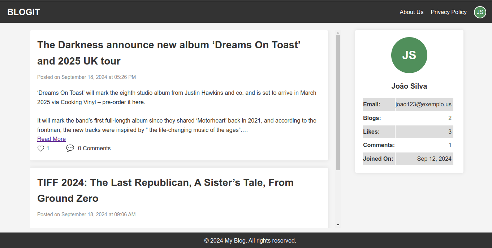

# Blogit (Mini blogging platform created in php and javascript)

This is a semester project of TU(Trivhuvan University) **Project I** of _4th semester_.

## Entities

- Database
  ```
  CREATE DATABASE IF NOT EXISTS blogit;
  ```
- Users

  ```
  CREATE TABLE IF NOT EXISTS users (
  id CHAR(36) PRIMARY KEY DEFAULT (UUID()),
  fname VARCHAR(20) NOT NULL,
  lname VARCHAR(20) NOT NULL,
  dob DATE NOT NULL,
  email VARCHAR(50) NOT NULL UNIQUE,
  password VARCHAR(50) NOT NULL,
  profile_pic VARCHAR(10) NOT NULL
  created_at TIMESTAMP DEFAULT CURRENT_TIMESTAMP
  );
  ```

- Blogs

  ```
  CREATE TABLE IF NOT EXISTS blogs (
    pid CHAR(36) PRIMARY KEY DEFAULT (UUID()),
    uid CHAR(36) NOT NULL,  -- Match the data type with 'id' in users table
    title VARCHAR(255) NOT NULL,
    content TEXT NOT NULL,
    created_at TIMESTAMP DEFAULT CURRENT_TIMESTAMP,
    FOREIGN KEY (uid) REFERENCES users(id) ON DELETE CASCADE
  );

  ```

- Comments

  ```
  CREATE TABLE IF NOT EXISTS comments (
    cid char(36) PRIMARY KEY DEFAULT (UUID()) ,
    blog_id char(36) NOT NULL,
    user_id char(36) NOT NULL,
    comment varchar(100) NOT NULL,
    created_at TIMESTAMP DEFAULT CURRENT_TIMESTAMP,
    FOREIGN KEY (blog_id) REFERENCES blogs(pid) ON DELETE CASCADE,
    FOREIGN KEY (user_id) REFERENCES users(id) ON DELETE CASCADE
  );
  ```

- Likes

  ```
  CREATE TABLE IF NOT EXISTS likes (
    lid char(36) PRIMARY KEY DEFAULT (UUID()),
    bid char(36) NOT NULL,
    uid char(36) NOT NULL,
    created_at TIMESTAMP DEFAULT CURRENT_TIMESTAMP,
    FOREIGN KEY (bid) REFERENCES blogs(pid) ON DELETE CASCADE,
    FOREIGN KEY (uid) REFERENCES users(id) ON DELETE CASCADE
  );
  ```

- Request For Block

```
   CREATE TABLE IF NOT EXISTS blocks (
    block_id char(36) PRIMARY KEY DEFAULT (uuid()),
    block_by char(36) NOT NULL,
    block_to char(36) NOT NULL,
    message VARCHAR(200) NOT NULL,
    created_at TIMESTAMP DEFAULT CURRENT_TIMESTAMP,
    FOREIGN KEY (block_by) REFERENCES users(id) ON DELETE CASCADE,
    FOREIGN KEY (block_to) REFERENCES users(id) ON DELETE CASCADE,
   );
```

## Pages

- Profile Page
  
